# دليل مستخدم برنامج (DORIS Desktop)

برنامج DORIS Desktop هو حل برمجي مصمم خصيصًا لمعالجة شهادات الوفاة بكفاءة عالية. يُسهّل البرنامج تحليل كميات هائلة من البيانات، ويدعم التشخيصات المرمزة والنصية على حد سواء. يتميز البرنامج بتصميم سهل الاستخدام، حيث يسمح باستيراد الشهادات بتنسيقات متنوعة مثل e-MCCD القياسي بتنسيق JSON، وExcel، وCSV.

يتطلب برنامج (DORIS Desktop) وجود مجموعة بيانات (DORIS) للعمل. يمكنك استيراد الشهادات من ملف بأحد التنسيقات المدعومة. بمجرد استيراد الملف، يتم حفظه كمجموعة بيانات (DORIS). بعد ذلك، يعتمد البرنامج على مجموعة البيانات هذه في جميع العمليات. على سبيل المثال، إذا استخدمتَ خاصية "المعالجة" لحساب السبب الرئيسي للوفاة في جميع الشهادات، فسيتم حفظ هذه المعلومات في مجموعة بيانات (DORIS). يمكنك دائمًا فتح مجموعة بيانات (DORIS) من خلال قائمة "فتح مجموعة بيانات DORIS" للعودة إلى حيث توقفت. 

يمكنك دائمًا تصدير الشهادات من مجموعة بيانات (DORIS) إلى التنسيقات المدعومة.

## استيراد البيانات
يمكنك استيراد الشهادات باستخدام أحد تنسيقات الملفات المدعومة. تتوفر تفاصيل التنسيقات وملفات نموذجية في الروابط أدناه:

- وصف تفصيلي لتنسيق  [الجدول لملفات Excel وCSV](csv-excel-format.md)

- وصف تفصيلي لتنسيق  [JSON القياسي](json-format.md)

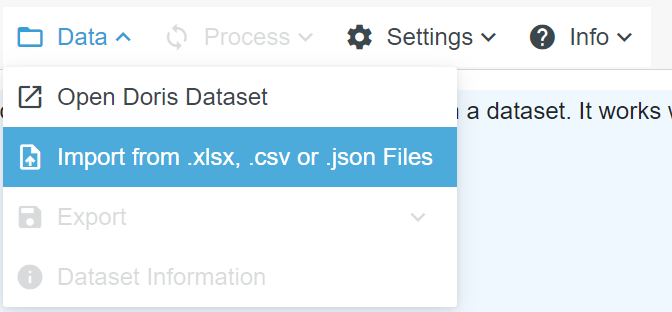{: style="width:40%"}

لاستيراد البيانات من ملف، اختر "استيراد من ملفات .xlsx أو .csv أو .json" من قائمة "البيانات". بعد ذلك، حدد الملف الذي ترغب في استيراده. سيطلب منك البرنامج بعد ذلك اسم ملف مجموعة بيانات (DORIS) التي سيتم إنشاؤها. بشكل افتراضي، يتم إنشاء مجموعات بيانات (DORIS) في مجلد "المستندات" في نظام Windows.

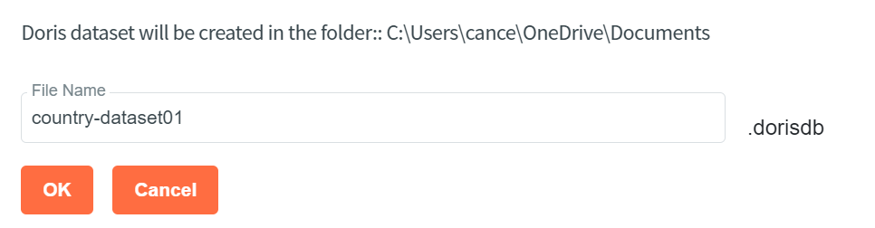{: style="width:50%"}

بعد إدخال اسم الملف والنقر على "موافق"، سيقوم برنامج (DORIS) باستيراد الملف وعرض محتوياته. سيعرض النظام شريط تقدم أسفل الشاشة إذا كان الملف كبيرًا ويستغرق استيراده وقتًا.

## العمل مع مجموعات بيانات (DORIS)
يعمل برنامج (DORIS Desktop) مع مجموعات بيانات (DORIS) التي يتم إنشاؤها بعد استيراد البيانات باستخدام تنسيق ملف مدعوم. بشكل افتراضي، يتم إنشاء مجموعات بيانات (DORIS) ضمن مجلد "المستندات" في نظام (Windows). يمكن تغيير هذا من قائمة "الإعدادات/تغيير مجلد مجموعة البيانات الافتراضي".

### فتح مجموعة بيانات
يمكنك فتح مجموعة بيانات (DORIS) موجودة باستخدام قائمة "البيانات/فتح مجموعة بيانات (DORIS)".

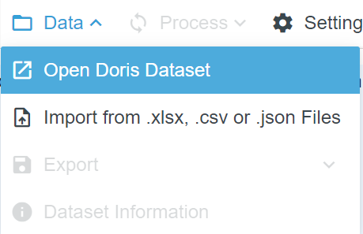{: style="width:30%"}

### معلومات مجموعة البيانات
بمجرد فتح مجموعة البيانات، يمكنك استخدام زر "معلومات مجموعة البيانات" أو قائمة "البيانات/معلومات مجموعة البيانات" لعرض معلومات حول مجموعة البيانات.
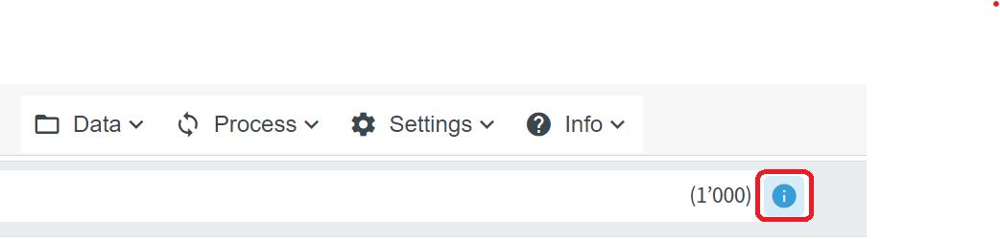{: style="width:50%"}

تتضمن هذه المعلومات عدد الشهادات، وما إذا كانت البيانات تحتوي على بيانات مشفرة أو نصية، وما إذا كانت البيانات مُعالجة، ومعلومات أخرى متنوعة حول مجموعة البيانات. يمكنك الاطلاع على مثال أدناه.

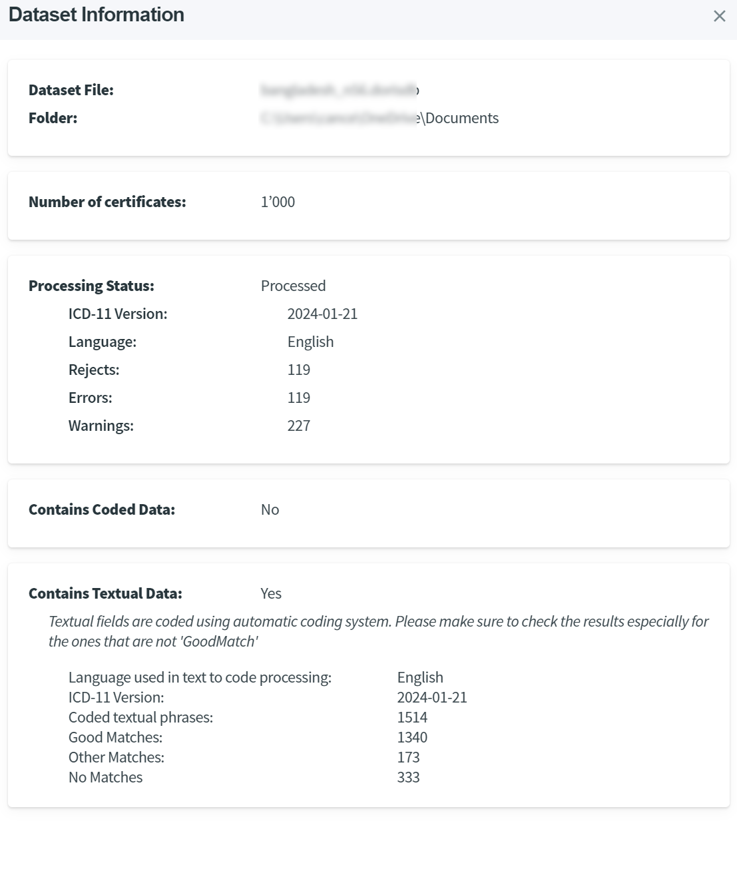{: style="width:60%"}

### العمل مع الشهادات التي تستخدم بيانات نصية
إذا كانت البيانات المستوردة لا تحتوي على رموز، بل على شروط نصية، فسيضيف البرنامج الرموز باستخدام معالجة تحويل النص إلى رمز أثناء مرحلة الاستيراد. تضع هذه العملية الرموز المُخصصة تلقائيًا في عمود "الرمز (تلقائي)" في الأداة، بالإضافة إلى عمود "المطابقة" الذي يُظهر جودة عملية تحويل النص إلى رمز.

نقترح أن يقوم خبراء بمراجعة عمليات التحويل التلقائي للنص إلى رمز، خاصةً عندما لا تكون المطابقة جيدة.
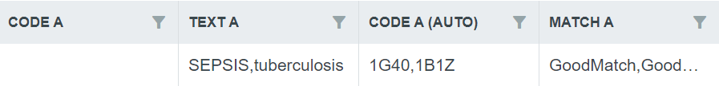{: style="width:60%"}

يُمكن استخدام زر "مشاكل تحويل النص إلى رمز" لتصفية الحالات التي تحتوي على نتائج غير جيدة.
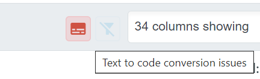{: style="width:20%"}

### معالجة مجموعة البيانات (الكشف عن السبب الرئيسي للوفاة):

ستقوم معالجة الملف بحساب السبب الرئيسي للوفاة لكل شهادة. يتم ذلك باستخدام قائمة "معالجة".
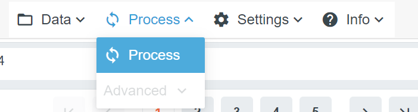{: style="width:40%"}

في حال كانت مجموعة البيانات كبيرة، سيعرض النظام شريط تقدم أسفل الشاشة لتوضيح التقدم.

بمجرد انتهاء المعالجة، ستظهر النتائج في عمود "السبب الرئيسي للوفاة". إذا كان السبب الرئيسي للوفاة ناتجًا عن عملية تنسيق لاحقة، يُدرج في عمود "السبب الرئيسي للوفاة مع معلومات التنسيق اللاحق". تُعلّم الشهادات المرفوضة في عمود "الرفض"، وتُدرج الأخطاء والتحذيرات في عمودي "الأخطاء والتحذيرات".

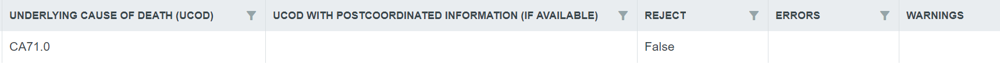{: style="width:80%"}

 يمكن تصفية الشهادات المرفوضة أو التي بها مشاكل أخرى بسهولة باستخدام زر "معالجة المشكلات".
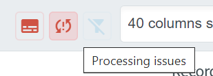{: style="width:20%"}  

### التصفية والفرز
يمكن فرز الشهادات حسب قيم عمود محدد بالنقر على اسم العمود.

كما يمكن التصفية باستخدام أيقونات التصفية الموجودة بجوار أسماء الأعمدة.
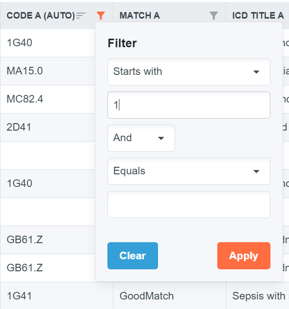{: style="width:30%"}

### تعديل الشهادات الفردية

يؤدي النقر على الرقم في عمود "المعرف" إلى فتح الشهادة في وضع العرض الكامل.
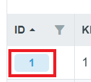{: style="width:80px"}

في وضع العرض الكامل، تُعرض جميع المعلومات الموجودة في الشهادة، بالإضافة إلى السبب الرئيسي للوفاة المحسوب، للمستخدم.
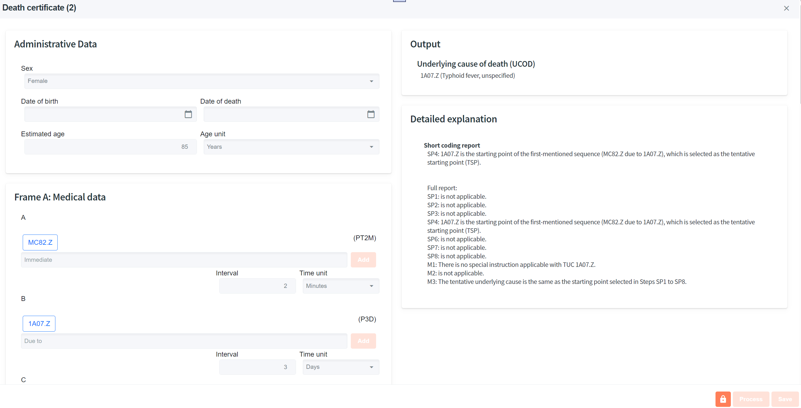{: style="width:80%"}

عند فتح الشهادة، لن يسمح النظام بتعديلها. لتحرير الشهادة، انقر على زر فتح القفل في الأسفل.
{: style="width:30px"}

بعد فتح القفل، يمكنك تعديل الشهادة. تقبل خانات الشروط رموز ICD-11 الصحيحة فقط. لا يُمكن تعديل التشخيص النصي، ولكن يُمكنك استبداله بإدخال رمز أو أكثر.

بعد الانتهاء من التعديل، يُمكنك حفظ التغييرات بالنقر على زر "حفظ". في حال عدم الحفظ، سيتجاهل البرنامج التغييرات بعد إغلاق وضع العرض الكامل.

لإغلاق وضع العرض الكامل، انقر على علامة X في الزاوية العلوية اليسرى.

يُعيد زر "معالجة" في وضع العرض الكامل معالجة الشهادة لتحديد السبب الرئيسي للوفاة. يتم حفظ هذه العملية فقط بعد الضغط على زر "حفظ".

كما يُمكنك معالجة جميع الشهادات المُعدّلة باستخدام قائمة "معالجة" بعد إغلاق وضع العرض الكامل.

### عرض التقارير للشهادات الفردية

توفر أداة (DORIS) أربعة أنماط عرض متكاملة لدعم المراجعة والتحقق والتدريب:

**التقرير النصي**: يوضح هذا العرض الخطوات وقواعد الوفيات التي طُبقت في تحديد السبب الرئيسي للوفاة. يتضمن التقرير خانة **تنبيهات** تُشير إلى أي تناقضات في المعلومات المُبلغ عنها أو تُشير إلى الحاجة إلى التحقق اليدوي. تظهر التنبيهات باللون الأصفر. يلي التنبيهات تقرير موجز يُلخص الخطوات الرئيسية المُطبقة. لفهم أكثر تفصيلًا، يتضمن قسم المخرجات تقريرًا كاملًا. يُقدم هذا التقرير الشامل شرحًا وافيًا للتسلسل المُتبع، بالإضافة إلى معلومات تفصيلية حول قواعد الوفيات والخطوات التي طُبقت أو لم تُطبق أثناء تحديد السبب الرئيسي للوفاة.

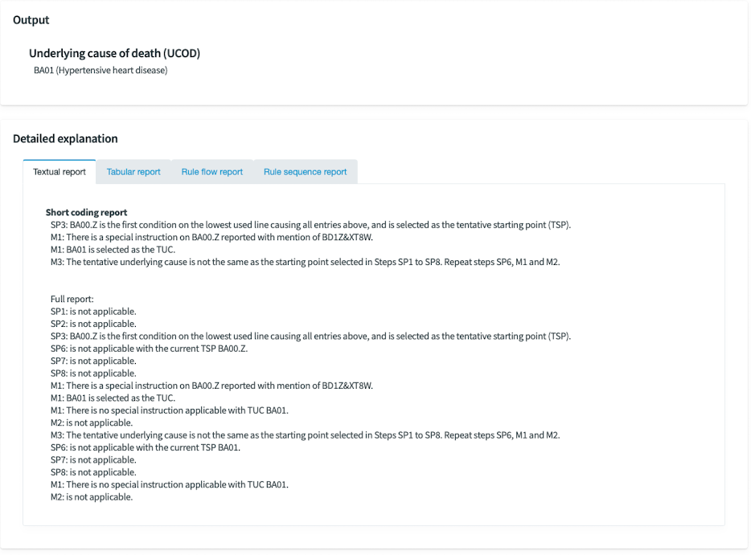{: style="width:40%"}

**التقرير الجدولي**: يعرض هذا العرض التفاعلي خطوات تحديد السبب الرئيسي للوفاة في شكل جدولي. بالنقر على الصفوف، يمكنك تتبع الخطوات واحدة تلو الأخرى من الأعلى إلى الأسفل، وسيتم تمييز القواعد المطبقة على الشهادة وفقًا لذلك.

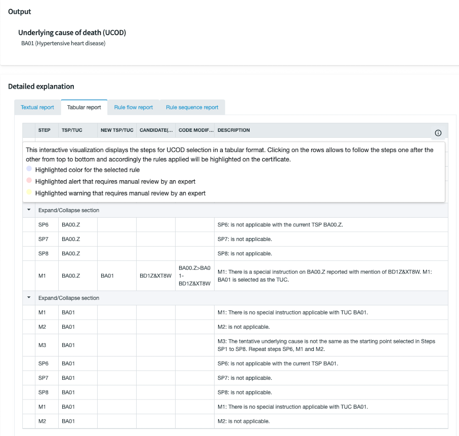{: style="width:40%"}

**تقرير تدفق القواعد**: يعرض هذا التقرير كسلسلة من القواعد المطبقة التي تؤدي في النهاية إلى (UCOD) المحدد.

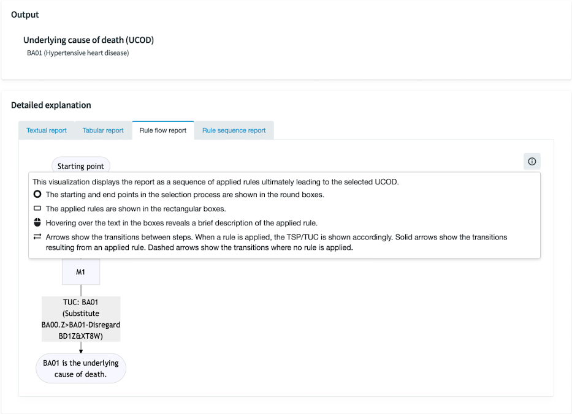{: style="width:40%"}

**تقرير تسلسل القواعد**: يعرض هذا الرسم البياني التقرير كسلسلة أفقية. تُدرج أدناه القواعد المُطبقة في كل خطوة، مع توضيح ترتيب تطبيقها من الأعلى إلى الأسفل

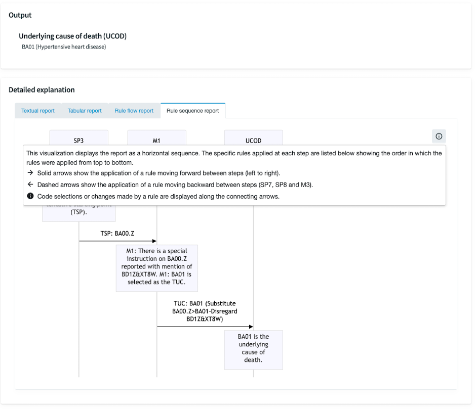{: style="width:40%"}

## الإعدادات
### تغيير اللغة
يمكنك تغيير لغة الأداة بالنقر على قائمة "الإعدادات/تغيير اللغة". بعد النقر، سيعرض النظام اللغات المتاحة في نافذة جديدة. تظهر اللغة الحالية باللون البرتقالي، وبالنقر على لغة أخرى يتم تغييرها.
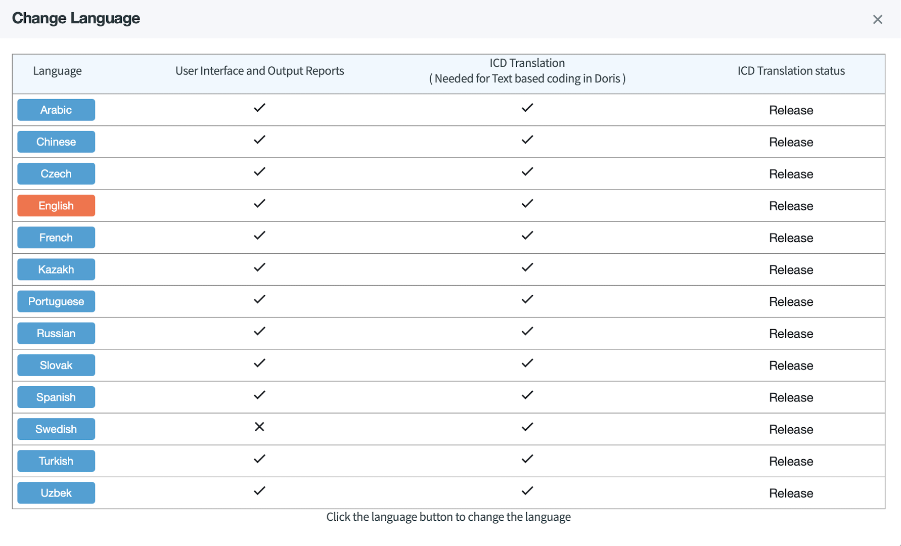{: style="width:50%"} 
The current language is shown in orange color and clicking on another language changes the language.

**هام!** يتطلب تغيير اللغة اتصالاً بالإنترنت إذا لم تكن اللغة المُختارة مُستخدمة من قبل، حيث يحتاج النظام إلى تنزيل رمز (ICD) بتلك اللغة لتمكين معالجة النص إلى رمز.

يستخدم النظام اللغة المُختارة لثلاثة أغراض:
- تغيير واجهة المستخدم للأداة إلى اللغة المُختارة. 
- أثناء الاستيراد، إذا كانت الشهادات تحتوي على تشخيصات نصية، فسيتم استخدام اللغة المختارة أثناء معالجة تحويل النص إلى رمز.
- أثناء معالجة الكشف عن السبب الرئيسي للوفاة، يتم عرض رسائل التحذير باللغة المختارة.

**هام!** لا يمكن تغيير اللغة إلا قبل فتح قاعدة البيانات. عند تغيير اللغة، يُرجى إغلاق التطبيق وإعادة المحاولة قبل فتح قاعدة البيانات.

### تغيير إصدار ICD-11
يستخدم برنامج (DORIS Desktop) افتراضيًا أحدث إصدار من (ICD-11).

يمكن استخدام إصدار آخر من (ICD-11) أثناء معالجة الشهادات. يتم ذلك من خلال قائمة الإعدادات/تغيير إصدار (ICD).

يدعم برنامج (DORIS) إصداري 2023 و2024 من تصنيف (ICD-11).

هام! يتطلب تغيير إصدار (ICD) اتصالاً بالإنترنت إذا لم يتم استخدام الإصدار المحدد من قبل، حيث يحتاج النظام إلى تنزيل هذا الإصدار من (ICD).

### تغيير مجلد مجموعة بيانات (DORIS) الافتراضي
يتم إنشاء مجموعات بيانات (DORIS) افتراضيًا في مجلد "المستندات" في نظام ويندوز. يمكنك تغيير هذا المجلد الافتراضي من قائمة "الإعدادات/تغيير مجلد مجموعة البيانات الافتراضي".

## تصدير البيانات
يمكنك تصدير البيانات بالتنسيقات المدعومة باستخدام قائمة "البيانات/تصدير xxxx".
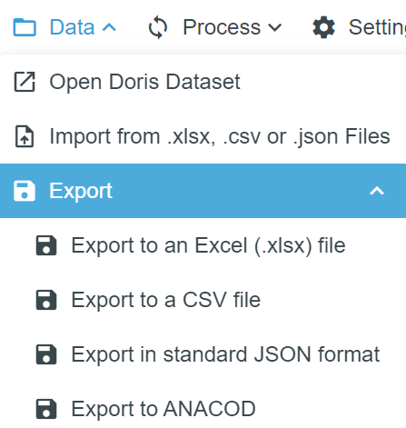{: style="width:20%"}
سيطلب منك النظام تحديد مكان حفظ الملف واسمه.

بعد تصدير مخرجات (ANACOD)، ستحتاج إلى ملء الأعمدة بالمعلومات الوطنية أو المحلية المتعلقة بالسكان، والسنة، ورمز الدولة وفقًا لمعيار ISO، وما إلى ذلك، قبل استيرادها إلى أداة (ANACOD-3). 
[ولمزيد من المعلومات حول (ANACOD-3)، راجع الرابط](icd.who.int/anacod)
