# نظام (DORIS) الإلكتروني

نظام (DORIS) الإلكتروني هو تطبيق ويب يمكن الوصول إليه عبر متصفح الإنترنت. يطبق قواعد التصنيف الدولي للأمراض (ICD) الخاصة بالوفيات على شهادات الوفاة الفردية لتحديد سبب الوفاة تلقائيًا. [يمكن الوصول إلى نسخة الويب من هنا.](https://icd.who.int/doris/workspace/en). 

يدعم النظام اللغات الـ 13 الرسمية المعتمدة من التصنيف (ICD-11)، بما في ذلك [العربية](https://icd.who.int/doris/ar), [الصينية](https://icd.who.int/doris/zh), [التشيكية](https://icd.who.int/doris/cs), [الإنجليزية](https://icd.who.int/doris/en), [الفرنسية](https://icd.who.int/doris/fr), [الكازاخية](https://icd.who.int/doris/kk), [البرتغالية](https://icd.who.int/doris/pt), [الروسية](https://icd.who.int/doris/ru),
 [السلوفاكية](https://icd.who.int/doris/sk), [الإسبانية](https://icd.who.int/doris/es), [السويدية](https://icd.who.int/doris/sv), [التركية](https://icd.who.int/doris/tr), and [الأوزبكية](https://icd.who.int/doris/uz). 

للتبديل بين اللغات، استخدم مفتاح اللغة في الزاوية العلوية اليمنى من الشاشة.

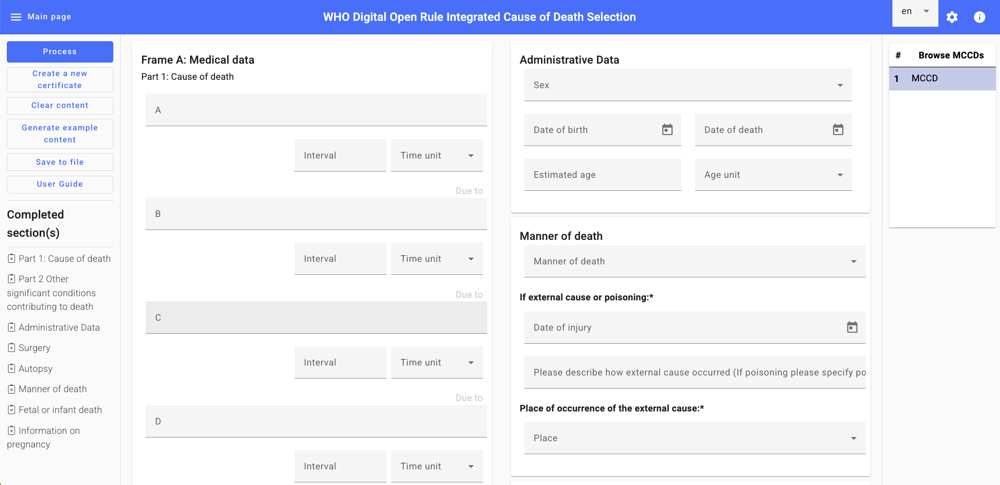{: style="width:40%"}

أدخل المعلومات المطلوبة عن المتوفى.

**البيانات الإدارية**: املأ البيانات التالية: الجنس، تاريخ الميلاد، تاريخ الوفاة، والعمر التقريبي (بالسنوات أو الأشهر أو الأسابيع أو الأيام أو الساعات أو الدقائق أو الثواني)، أو اتركه غير معروف.

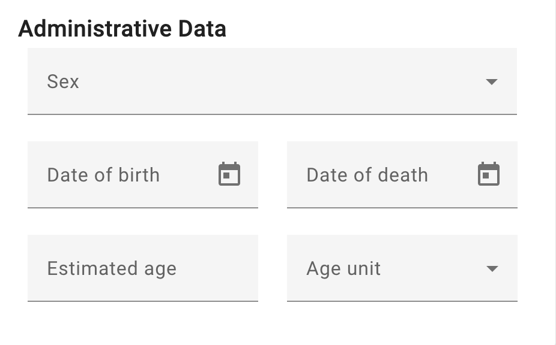{: style="width:40%"}

في الإطار (أ)، ترتبط حقول **البيانات الطبية** بأداة ترميز التصنيف الدولي للأمراض (ICD-11)، مما يسمح للمستخدمين بالبحث باستخدام المصطلح أو رمز التصنيف (ICD-11). 

الجزء الأول: سبب/أسباب الوفاة - أكمل الأسطر أ، ب، ج، د مع تحديد الفترات الزمنية لكل منها.

الجزء الثاني: حدد أي حالات مرضية أخرى ساهمت في الوفاة، مع تحديد الفترات الزمنية لكل منها. في هذا القسم، يمكن تحديد الفترات الزمنية بشكل منفصل لكل حالة مرضية مُبلغ عنها. للقيام بذلك، يجب على المستخدمين البحث عن الحالة المرضية باستخدام المصطلح أو رمز التصنيف الدولي للأمراض (ICD-11) باستخدام أداة الترميز، ثم تحديد الفترة الزمنية المناسبة بعد اختيار الحالة.

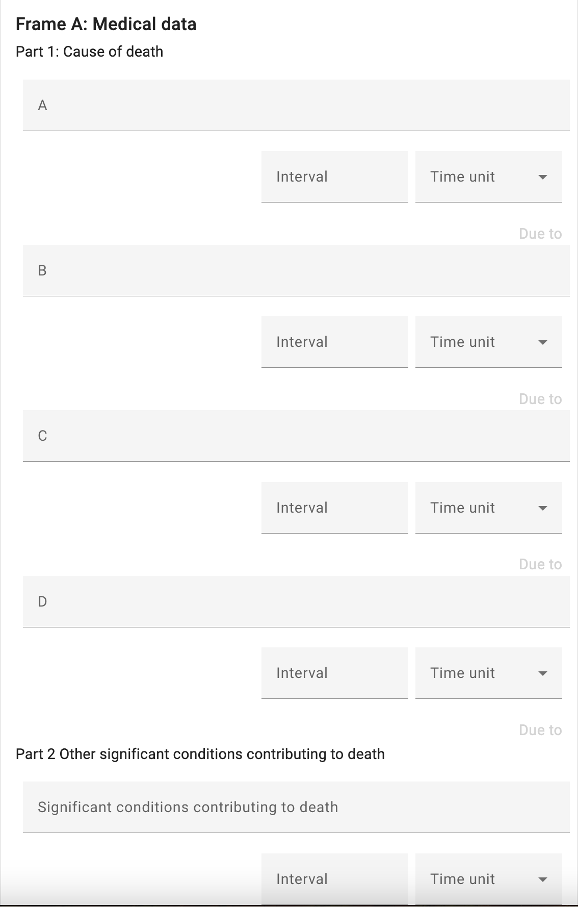{: style="width:40%"}

يتكون الإطار ب من الحقول التالية:
**تفاصيل الجراحة**: قدم أي معلومات ذات صلة بالعمليات الجراحية التي أُجريت للمتوفى من خلال الإجابة على الأسئلة.

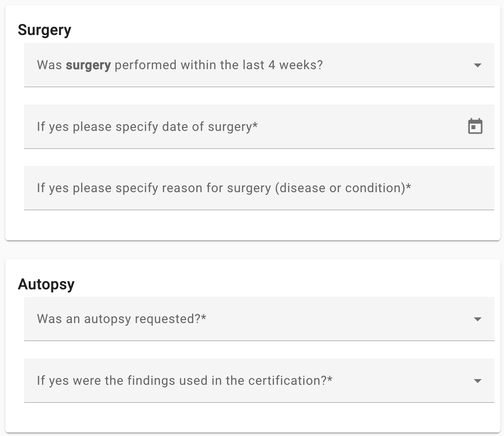{: style="width:40%"}

**طريقة الوفاة**: حدد طريقة حدوث الوفاة (مثل: طبيعية، حادث، انتحار، قتل).

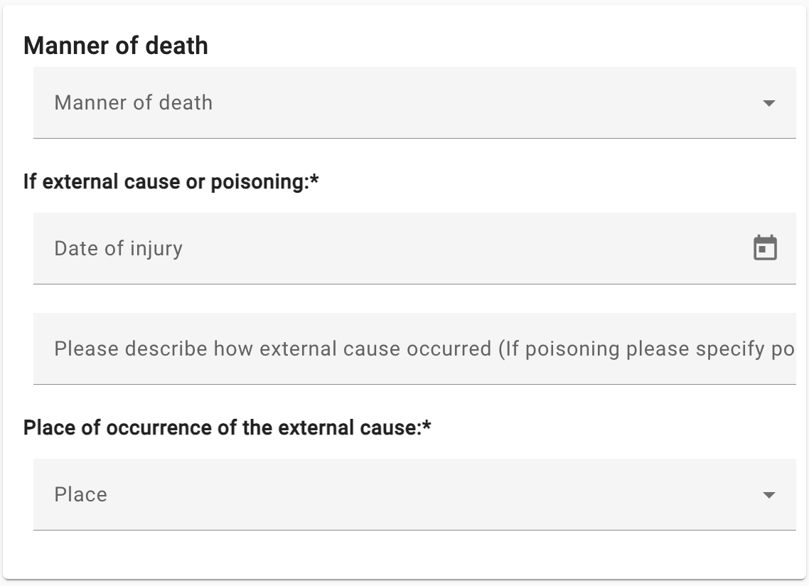{: style="width:40%"}

**مكان وقوع السبب الخارجي**: حدد المكان الذي وقع فيه السبب الخارجي (مثل: حادث، إصابة). هذه المعلومات ضرورية لتوثيق ظروف الوفاة بدقة.

**وفاة الجنين أو الرضيع**: يُرجى تعبئة المعلومات المطلوبة حول الحمل المتعدد، أو ولادة جنين ميت، مع تحديد عدد الساعات التي عاشها الوليد (إن وُجدت)، ووزنه عند الولادة، وعدد أسابيع الحمل المكتملة، وعمر الأم، وفي حال كانت الوفاة في فترة ما حول الولادة، يجب تحديد حالة الأم التي أثرت على الجنين.

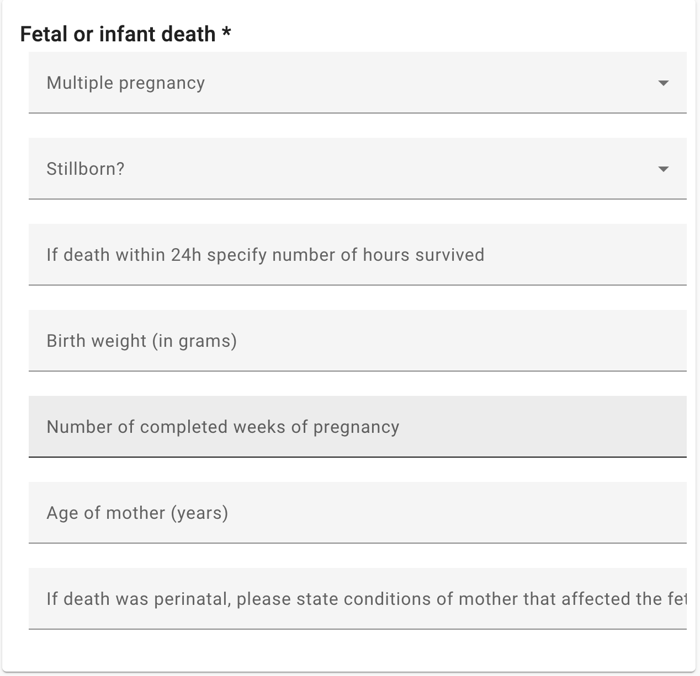{: style="width:40%"}

للسيدات (في فترة الإنجاب): 

**حالة الحمل**: هل كانت المتوفاة حاملاً وقت الوفاة؟ يُرجى اختيار الخيار المناسب.

**مدة الحمل**: إذا كانت المتوفاة حاملاً، يُرجى تحديد مدة الحمل.

**مساهمة الحمل في الوفاة**: يُرجى تحديد ما إذا كان للحمل دور في وفاة المرأة.

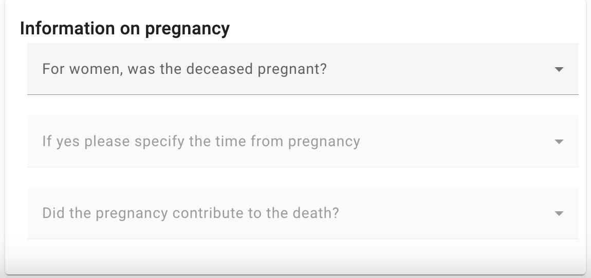{: style="width:40%"}

لتوضيح وظائف نسخة (DORIS) الإلكترونية، يُقدم زر **نماذج الأمثلة** بعض الأمثلة لتوضيح كيفية عمل النسخة الإلكترونية. يمكن للمستخدمين الرجوع إلى هذه الأمثلة لفهم كيفية استخدام النسخة الإلكترونية بفعالية.

بالإضافة إلى ذلك، تم تقديم زر **المحتوى الواضح**. بالنقر على هذا الزر، يمكن للمستخدمين إنشاء شهادة وفاة جديدة مع مسح جميع الحقول، مما يسمح لهم بالبدء بإدخال جديد دون أي بيانات سابقة.

لمعالجة السبب الرئيسي للوفاة المطلوب، ما على المستخدمين سوى النقر على زر **معالجة**. سيؤدي هذا الإجراء إلى إنشاء المعلومات اللازمة بناءً على البيانات المُدخلة، مما يساعد المستخدمين على تحديد السبب الرئيسي للوفاة.

يمكن ملء ومعالجة عدة شهادات طبية لأسباب الوفاة في نفس الجلسة باستخدام نسخة الويب. لعرض نتيجة شهادة معينة، انتقل إلى قسم "استعراض شهادات الوفاة" في أعلى اليمين، وانقر على الشهادة المطلوبة لعرض تفاصيل معالجتها.

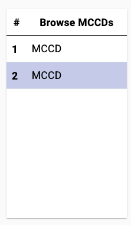{: style="width:30%"}

**قسم المخرجات** 

بمجرد تحديد السبب الرئيسي للوفاة، سيظهر في قسم **المخرجات** الذي يتضمن حقلين منفصلين متعلقين **بالسبب الرئيسي للوفاة**. يُمثل الحقل الأول السبب الرئيسي الوحيد للوفاة الذي تم اختياره بناءً على المعلومات المُقدمة، وهو مُظلل باللون الأصفر لجذب انتباه المستخدمين. بالإضافة إلى ذلك، يتضمن قسم "المخرجات"، إن وُجد، حقلاً خاصاً **بالسبب الرئيسي للوفاة العنقودي**. يشير هذا الحقل إلى الرموز المُنسقة لاحقاً، إن وُجدت، مما يوفر سياقاً وتفاصيل إضافية.

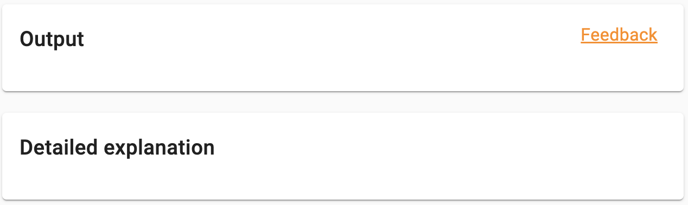{: style="width:40%"}

توفر أداة (DORIS) أربعة أنماط عرض بيانات متكاملة لدعم المراجعة والتحقق والتدريب:

**التقرير النصي**: يوضح هذا الرسم البياني الخطوات وقواعد الوفيات التي طُبقت في تحديد السبب الرئيسي للوفاة. يتضمن التقرير خانة **تنبيهات** تُشير إلى أي تناقضات في المعلومات المُبلغ عنها أو تُشير إلى الحاجة إلى التحقق اليدوي. تظهر "التنبيهات" باللون الأصفر. يلي "التنبيهات" تقرير موجز يُلخص الخطوات الرئيسية المُطبقة. وللحصول على فهم أكثر تفصيلًا، يتضمن قسم المخرجات تقريرًا كاملًا. يُقدم هذا التقرير الشامل شرحًا وافيًا للتسلسل المُتبع، بالإضافة إلى معلومات تفصيلية حول قواعد الوفيات والخطوات التي طُبقت أو لم تُطبق أثناء تحديد السبب الرئيسي للوفاة.

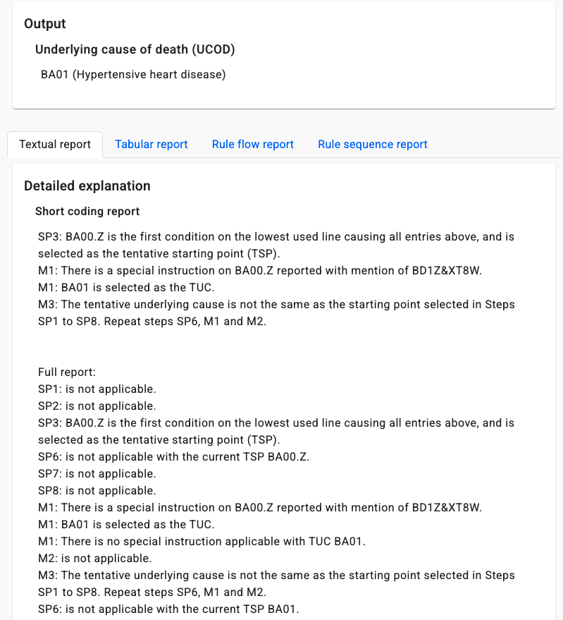{: style="width:40%"}

**التقرير الجدولي:**  يعرض هذا الرسم البياني التفاعلي خطوات اختيار السبب الرئيسي للوفاة في شكل جدولي. يُتيح النقر على الصفوف تتبع الخطوات واحدة تلو الأخرى من الأعلى إلى الأسفل، وسيتم تمييز القواعد المُطبقة في الشهادة وفقًا لذلك.

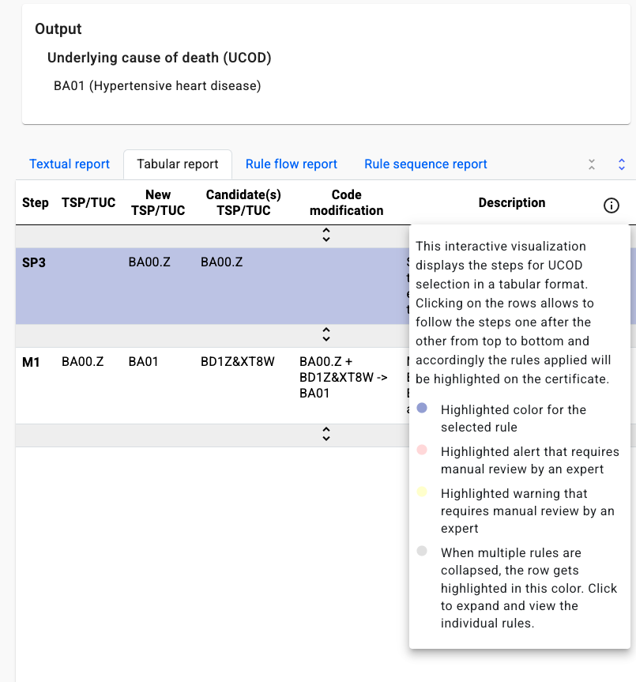{: style="width:40%"}

**تقرير تدفق القواعد:** يعرض هذا الرسم البياني التقرير كسلسلة من القواعد المُطبقة التي تؤدي في النهاية إلى تحديد السبب الرئيسي للوفاة.

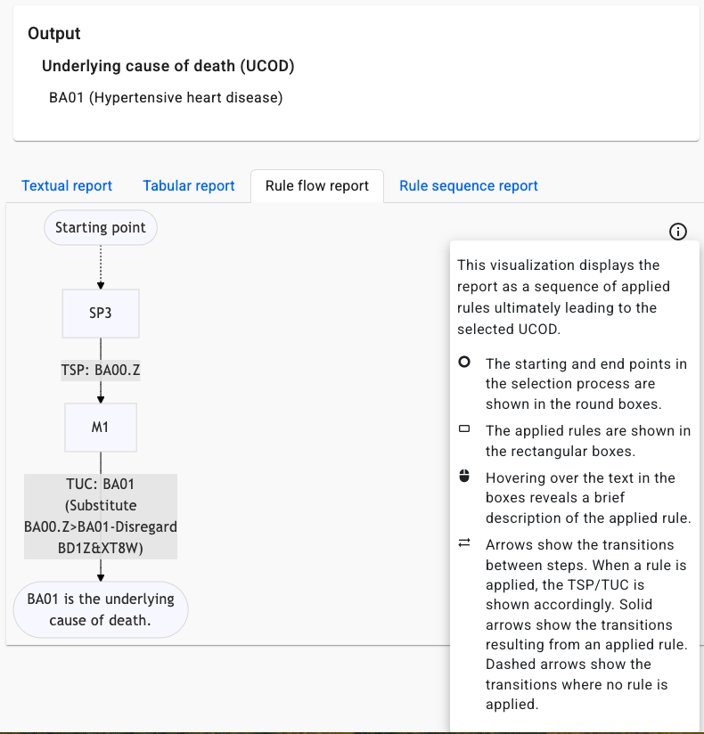{: style="width:40%"}

**تقرير تسلسل القواعد:** يعرض هذا الرسم البياني التقرير كسلسلة أفقية. ترد أدناه القواعد المحددة المطبقة في كل خطوة، موضحة الترتيب الذي تم به تطبيق القواعد من الأعلى إلى الأسفل.

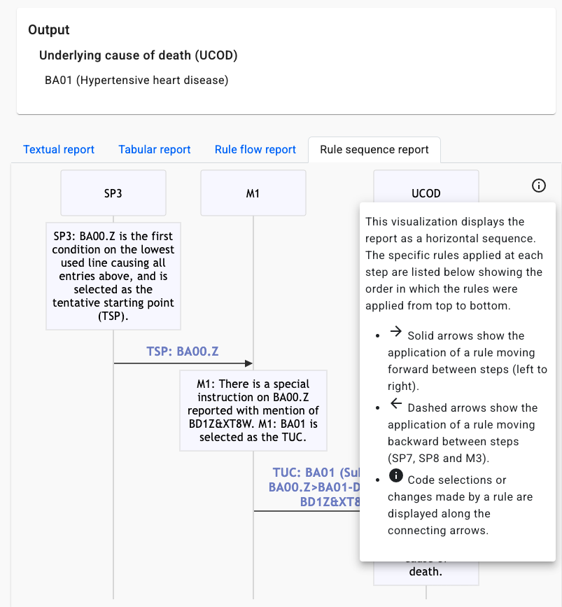{: style="width:40%"}

