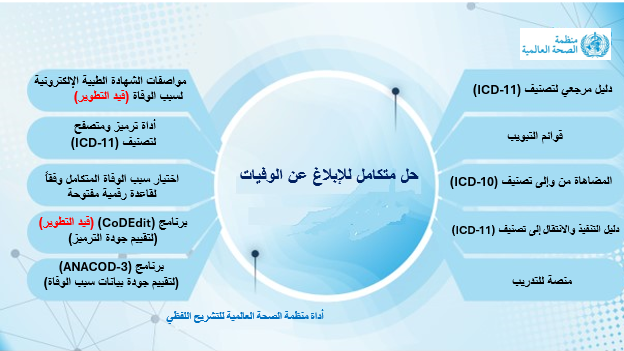

# حل رقمي متكامل للإبلاغ عن الوفيات وفقًا لتصنيف ICD-11

كجزء من الحل الشامل للإبلاغ عن الوفيات وفقًا للتصنيف الدولي للأمراض (ICD-11)، طورت منظمة الصحة العالمية مجموعة من الأدوات الرقمية لتحديد أسباب الوفاة، تتضمن برامج تساعد في الترميز، واختيار السبب الرئيسي للوفاة، وتقييم جودة الترميز أو جودة البيانات. صُممت هذه الأدوات الرقمية لتعزيز دقة وكفاءة الإبلاغ عن الوفيات، وضمان توحيد وموثوقية معلومات أسباب الوفاة.

 > يمكن الوصول إلى المزيد من البرامج والأدوات عبر  [صفحة منظمة الصحة العالمية الخاصة بأسباب الوفاة ](https://www.who.int/standards/classifications/classification-of-diseases/cause-of-death) أو [الصفحة الرئيسية للتصنيف الدولي للأمراض (ICD-11)](https://icd.who.int) 

## الشهادة الطبية الإلكترونية لسبب الوفاة (eMCCD):

تُعد الشهادة الطبية لسبب الوفاة أساسًا لجمع المعلومات حول أسباب الوفاة. صُمم النموذج لجمع جميع الجوانب ذات الصلة بتحديد سبب الوفاة، وهو مستقل عن أي مراجعة للتصنيف الدولي للأمراض. وبالإضافة إلى النموذج الورقي المذكور في القسم 3.14، تتوفر المواصفات الفنية للنموذج الرقمي. تهدف هذه المواصفات إلى توحيد عملية الإدخال بما يتماشى مع النموذج القياسي، وتتضمن قاموس بيانات لأسماء الحقول وترميز المحتوى، مما يسمح بمعالجة المحتوى باستخدام واجهة برمجة التطبيقات (API) للترميز، بالإضافة إلى برامج لاختيار السبب الرئيسي للوفاة.

## متصفح وأداة ترميز ICD-11

يوفر تصنيف (ICD-11) بلغات متعددة، متصفحًا يُعرف باسم "المتصفح الأزرق" لتصنيف ICD-11، وأداة ترميز ذكية. يمكن الوصول إليهما من الصفحة الرئيسية لتصنيف ICD-11، ويتيح كلاهما للمستخدمين البحث عن التشخيصات، والمصطلحات المفهرسة، والمفاهيم، والتشريح، والمرادفات، أو أي عناصر أخرى ضمن محتوى ICD-11.

 > [للمزيد من المعلومات، انقر هنا.](https://icd.who.int/browse)

## أداة (DORIS) لاختيار السبب الرئيسي للوفاة ضمن قاعدة منظمة الصحة العالمية الرقمية المفتوحة

صُممت أداة (DORIS) للمساعدة في الاختيار الآلي للسبب الرئيسي للوفاة. يمكن استخدام هذه الأداة عبر الإنترنت أو دون اتصال بالإنترنت، وهي تدعم النصوص الحرة ومجموعات البيانات المشفرة وفقًا لتصنيف ICD-11. لتمكين معالجة البيانات بواسطة البرنامج، تم تحويل قواعد الوفيات في التصنيف الدولي للأمراض (ICD) الموضحة في القسم 2.21 إلى صيغة رقمية، مما أدى إلى إنشاء قاعدة بيانات رقمية لقواعد الوفيات وفقًا لتصنيف (ICD-11). للحصول على مساعدة في استخدام الأداة، يُرجى إرسال بريد إلكتروني إلى icd@who.int.

 >  [للمزيد من المعلومات، انقر هنا.](https://icd.who.int/doris) 

## تحليل الوفيات وأسبابها -3 (ANACOD-3)
يُجري هذا البرنامج تحليلًا شاملًا ومنهجيًا لبيانات الوفيات وأسبابها. يحلل ANACOD-3 البيانات على المستوى دون الوطني لتحديد المشكلات المحتملة المتعلقة بالعدالة الصحية أو أنماط تفشي الأمراض؛ كما يحلل البيانات على مدى فترات زمنية متعددة لتحليل الاتجاهات، ويتيح تحليل بيانات أسباب الوفاة المصنفة وفقًا للتصنيف الدولي للأمراض - المراجعتين العاشرة (ICD-10) والحادية عشر (ICD-11). وهو متوفر بلغات متعددة. للحصول على مساعدة في استخدام الأداة، يُرجى إرسال بريد إلكتروني إلى mortality@who.int.

 > [للمزيد من المعلومات، انقر هنا](https://icd.who.int/anacod)

## برنامج CodeEdit

برنامج يُساعد مُنتجي إحصاءات أسباب الوفاة على تعزيز قدرتهم على إجراء فحوصات دورية للتحقق من صحة ترميز البيانات. يُتيح البرنامج تحليل بيانات أسباب الوفاة المُرمّزة وفقًا لتصنيفيو(ICD-10) و (ICD-11).

 >  [للمزيد من المعلومات، انقر هنا](https://www.who.int/standards/classifications/classification-of-diseases/services/codedit-tool#/upload)

# مصادر أخرى مُتاحة حول أسباب الوفاة

## توصيات منظمة الصحة العالمية لإجراء فحص خارجي للجثة وكيفية تعبئة شهادة الوفاة
وثيقة تُقدّم توصيات لإجراء فحص خارجي للجثة وتعبئة الشهادة الطبية لسبب الوفاة باستخدام شهادة منظمة الصحة العالمية الدولية لعام 2016.

 > [للمزيد من المعلومات، انقر هنا](https://www.who.int/publications/m/item/who-recommendations-for-conducting-an-external-inspection-of-a-body-and-filling-in-the-medical-certificate-of-cause-of-death)

### نشرة شهادة سبب الوفاة: أداة للأطباء المُعتمدين

تُلخّص هذه النشرة توصيات منظمة الصحة العالمية المُوجّهة للأطباء المُعتمدين لتعزيز الممارسات الجيدة في إصدار الشهادات الطبية لأسباب الوفاة. يُسلّط هذا الدليل الضوء على عملية إصدار الشهادات الطبية، بما في ذلك تأكيد الوفاة، وفحص الجثة، وتحديد ملابسات الوفاة وسببها، واستكمال شهادة سبب الوفاة الطبية.

 > [للمزيد من المعلومات، انقر هنا.](https://www.who.int/publications/m/item/cause-of-death-certification-flyer---a-tool-for-certifying-physicians)

### أداة منظمة الصحة العالمية التفاعلية للتعلم الذاتي

صُممت أداة التدريب الإلكترونية لمنظمة الصحة العالمية للتعلم الذاتي للاستخدام في الفصول الدراسية. يتيح هيكلها ذو الوحدات المعيارية إمكانية تخصيص الدورات التدريبية وفقًا لاحتياجات مجموعات من المستخدمين. وتتضمن الأداة وحدتين تدريبيتين متعلقتين بالوفيات.

 >  [للمزيد من المعلومات، انقر هنا.](https://icd.who.int/training/icd10training/ICD-10%20Death%20Certificate/html/index.html)

### نشرة أسباب الوفاة: دليل مرجعي سريع

تُعدّ نشرة أسباب الوفاة دليلًا مرجعيًا سريعًا لشهادة الوفاة، مع الالتزام بقواعد التصنيف الدولي للأمراض (ICD) الخاصة بالوفيات. يُلخص هذا الدليل النقاط الرئيسية التي يجب مراعاتها عند تسجيل سبب الوفاة بدقة.

>  [للمزيد من المعلومات، انقر هنا.](https://cdn.who.int/media/docs/default-source/classification/icd/cause-of-death/causeofdeathflyer_2015.pdf?sfvrsn=9ec05f86_1#/upload)
