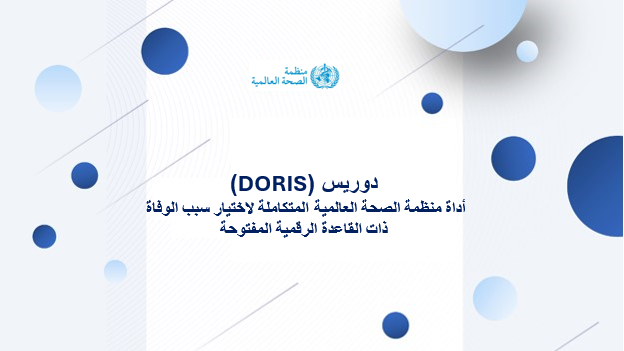
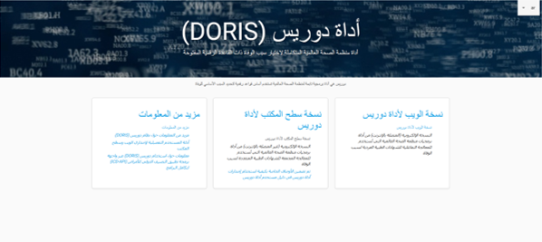

# أداة اختيار أسباب الوفاة المتكاملة ذات القاعدة الرقمية المفتوحة

إن أداة  **(DORIS)** هي أداة متعددة اللغات مصممة لتسهيل تحديد السبب الرئيسي للوفاة. يقوم هذا البرنامج بفحص المعلومات الواردة في شهادات الوفاة، وتساعد في اختيار السبب الرئيسي للوفاة تلقائيًا وفقًا لقواعد الوفيات في التصنيف الدولي للأمراض (ICD) الذي تم رقمنته بالكامل.

تلعب قدرات التحليل في برنامج **(DORIS)** دورًا حاسمًا في استخلاص رؤى قيّمة من الكم الهائل من البيانات الموجودة في شهادات الوفاة. يستخدم البرنامج خوارزمية متقدمة لمعالجة المعلومات وتفسيرها، مما يمكّن المستخدمين من الكشف عن الأنماط والاتجاهات والأسباب الرئيسية للوفاة. يُعد هذا التحليل بالغ الأهمية لرصد الصحة العامة، والدراسات الوبائية، وصنع القرار السياسي، حيث يُسهّل تحديد المؤشرات الصحية الرئيسية، وانتشار الأمراض، والمجالات المحتملة للتدخل.

توفر قدرة أداة  **(DORIS)** على التعامل مع آلاف شهادات الوفاة بصيغتي النص والترميز، ودعمه لصيغ ملفات متعددة، فوائد جمة للمستخدمين. تُبسّط أداة  (DORIS) عمليات تحليل البيانات، ويعزز التوافق مع مصادر البيانات المختلفة، ويُمكّن المستخدمين من استخلاص رؤى قيّمة من مجموعات البيانات الضخمة، مما يُسهم في نهاية المطاف في تحسين نتائج الصحة العامة ودعم اتخاذ القرارات المستنيرة.

تُوفر **(DORIS)** خيارات استخدام متعددة، مما يُتيح للمستخدمين المرونة والراحة. يُمكن استخدامها كتطبيق ويب أو كتطبيق مستقل بواجهة مستخدم يُمكن تثبيتها على أي جهاز كمبيوتر.

تدعم **(DORIS)** عشر لغات من لغات التصنيف الدولي للأمراض المراجعة الحادية عشر (ICD-11) ، بما في ذلك [العربية](https://icd.who.int/doris/ar), [الصينية](https://icd.who.int/doris/zh), [التشيكية](https://icd.who.int/doris/cs), [الإنجليزية](https://icd.who.int/doris/en), [الفرنسية](https://icd.who.int/doris/fr), [البرتغالية](https://icd.who.int/doris/pt), [الروسية](https://icd.who.int/doris/ru), [الإسبانية](https://icd.who.int/doris/es), [التركية](https://icd.who.int/doris/tr), و [الأوزبكية](https://icd.who.int/doris/uz)

  -يُعد إصدار الويب لأداة  (DORIS) تطبيقًا قائمًا على الويب يُمكن الوصول إليه عبر متصفح الإنترنت. يُطبّق قواعد التصنيف الدولي للأمراض (ICD) الخاصة بالوفيات على شهادات الوفاة الفردية لتحديد سبب الوفاة. يُمكن الوصول إلى نسخة الويب من هنا.(https://icd.who.int/doris/workspace/en)

  > [للمزيد من المعلومات حول نسخة الويب، انقر هنا.](doris-web.md)

  -يُعد إصدار سطح المكتب ل (DORIS) للمعالجة الدفعية برنامجًا مكتبيًا يُمكن تثبيته على أجهزة الكمبيوتر المحلية. صُمّم هذا البرنامج لتسهيل المعالجة الدفعية لكميات كبيرة من شهادات الوفاة. سواءً أكان العمل مع النصوص أو الرموز، يحلل هذا البرنامج آلاف شهادات الوفاة ويدعم صيغًا متعددة، منها Excel وCSV  و JSON .  
 > [للمزيد من المعلومات حول نسخة سطح المكتب](doris-desktop-user-guide.md)
  
  - التكامل مع البرامج الأخرى: بالإضافة إلى البرامج المذكورة أعلاه، يمكنك الوصول إلى (DORIS) عبر واجهة برمجة تطبيقات (ICD-API). تتيح هذه الميزة التكامل بسهولة مع الأنظمة والتطبيقات الأخرى.
> [للمزيد من المعلومات حول إستخدام أداة (DORIS)   بواسطة واجهة برمجة تطبيقات (ICD-API).](doris-api.md)

  
