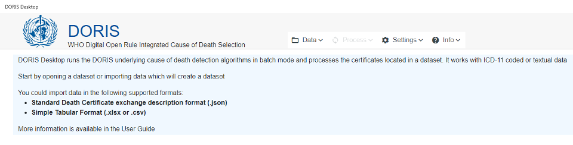

**دوريس (DORIS): ثورة في إدارة بيانات أسباب الوفاة عالميًا باستخدام التصنيف الدولي للأمراض (ICD-11)**

مرحبًا بكم في (DORIS)، الأداة الرقمية المتكاملة القائمة على القواعد المفتوحة، والمصممة لتبسيط عملية اختيار الأسباب الكامنة وراء الوفاة باستخدام التصنيف (ICD-11). إن أداة (DORIS) هي حل برمجي مبتكر ومتعدد اللغات، يُحدث نقلة نوعية في معالجة شهادات الوفاة، ويعزز إدارة بيانات أسباب الوفاة عالميًا.

**ابتكار تعاوني**
: طُوّرت (DORIS) بالشراكة مع دول وخبراء في مجال الوفيات من شبكة منظمة الصحة العالمية لمعلومات الوفيات (WHO-FIC)، وهي حجر الزاوية في حلول منظمة الصحة العالمية الرقمية للإبلاغ عن الوفيات. وتتمتع (DORIS) بميزات قوية من التصنيف (ICD-11)، المعيار الذهبي في إدارة البيانات الصحية والإبلاغ عنها.

**تعزيز السياسات الصحية والبحوث**
: تتماشى (DORIS) مع الدليل المرجعي للتصنيف (ICD-11)، وهو إرث يمتد على مدى 150 عامًا، ويلعب دورًا محوريًا في صياغة السياسات الصحية، وتحسين تخصيص الموارد، ودفع عجلة البحث العلمي من خلال تحسين ترميز الوفيات والإبلاغ عنها.

**الميزات الرئيسية**

**التوافق الدلالي والوصول غير المقيد**: تمامًا مثل أدوات (ICD-11) الأخرى، يُمكن الوصول إلى (DORIS) مجانًا، ويضمن توافقًا دلاليًا سلسًا، ويعمل عبر الإنترنت ودون اتصال. يتيح ذلك مشاركة البيانات وتحليلها على نطاق واسع عبر مختلف المنصات.

**إمكانيات متعددة اللغات:** يدعم (DORIS) عشر لغات من لغات  تصنيف (ICD-11)، بما في ذلك [العربية](https://icd.who.int/doris/ar), [الصينية](https://icd.who.int/doris/zh), [التشيكية](https://icd.who.int/doris/cs), [الإنجليزية](https://icd.who.int/doris/en), [الفرنسية](https://icd.who.int/doris/fr), [البرتغالية](https://icd.who.int/doris/pt), [الروسية](https://icd.who.int/doris/ru), [الإسبانية](https://icd.who.int/doris/es), [التركية](https://icd.who.int/doris/tr), و [الأوزباكية](https://icd.who.int/doris/uz). ومع ازدياد نطاق لغات ICD-11، ستزداد خيارات اللغات في (DORIS)، مما يضمن سهولة الوصول والشمولية على مستوى العالم.

**تكوين قابل للتخصيص** : خصّص تجربة استخدامك لأداة (DORIS) من خلال إعدادات قابلة للتخصيص لتفضيلات اللغة وتعديلات إصدار (ICD-11)، مما يضمن تجربة مستخدم شخصية تلبي الاحتياجات الوطنية والتنظيمية.

**صيانة سهلة** : يتم تحديث (DORIS) باستمرار بأحدث التطورات في (ICD-11)، مما يضمن صيانة سلسة ومواءمة مستمرة مع تحديثات التصنيف وأفضل الممارسات.

**استيراد البيانات بكفاءة** : استدعِ شهادات الوفاة بصيغ مثل JSON وExcel وCSV. تحسب أداة (DORIS) السبب الرئيسي للوفاة وتتعامل بكفاءة مع آلاف الشهادات.

**تحويل تلقائي للنصوص إلى رموز** : يعزز نظام (DORIS) الدقة من خلال التحويل التلقائي للتشخيصات النصية إلى رموز (ICD-11)، مما يبسط عملية الترميز.

**تحسين كفاءة سير العمل** : بدءًا من فحص شهادات الوفاة بدقة وصولًا إلى سهولة الفلترة والفرز والمعالجة، يُحسّن نظام (DORIS) سير العمل ويضمن الامتثال لمعايير (ICD-11).

**تصدير البيانات بسهولة** : صدّر الشهادات بسهولة لتحليلها ومشاركتها. يوفر نظام (DORIS) تطبيقات قواعد مفصلة واختيارات السبب الرئيسي للوفاة (UCOD)، وهو متوافق تمامًا مع أداة (ANACoD-3) لتحليل بيانات الوفيات، داعماً البحث والمراقبة وتطوير السياسات.

ولا يقتصر دور نظام (DORIS) على تسهيل نشر بيانات الوفيات فحسب، بل يضمن أيضًا سلامة البيانات والامتثال لمعايير (ICD-11) الدولية. انضم إلى مستقبل إدارة بيانات أسباب الوفاة مع نظام (DORIS).

[تعليمات حول تنزيل وتثبيت برنامج (DORIS Desktop)](doris-desktop-download-installation.md)
