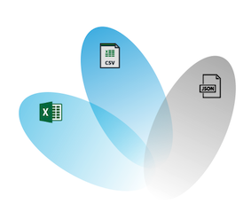

# DORIS User Interface (Desktop Version for batch processing) 

DORIS User Interface is a desktop software that can be installed on local computers. It is designed to allow effortless batch processing of large volumes of death certificates. Whether working with text or code modes, this software analyzes thousands of death certificates and supports multiple formats, Excel, CSV, and JSON.

On the DORIS homepage, users can find the template for the input file that is supported by the DORIS tool. This template is specifically designed to ensure compatibility and proper data input in the DORIS tool. By accessing the DORIS homepage, users can easily download the template and utilize it as a guideline for preparing their input file, ensuring that it meets the required format and structure. 

## Download and Installation

1 - Go to the DORIS homepage by visiting the website icd.who.int/doris.
2 - On the homepage, locate and click on the "More information and Download" option. This will redirect users to the page containing instructions for using the DORIS Offline Tool.
3 - Under for the section titled "Download and Installation" users will find the necessary information and resources to download the DORIS tool. The DORIS tool for batch processing can be downloaded from: [Desktop Version](https://icdcdn.who.int/doris/DorisUI_0.6.0.0_x64-rc1.msix)  
4 - Follow the provided instructions to download the DORIS tool onto local desktops or computer systems. The installation process involves double-clicking on the downloaded file and following the on-screen instructions provided. 
By following these steps, users will be able to successfully download the DORIS User Interface Desktop Version and initiate batch processing activities.

## Supported file formats

## Using DORIS User Interface Desktop Version - Step-by-Step Instructions

In order to use the DORIS tool effectively, users are required to provide an input file that includes the death certificates they want to process and analyze. The tool will examine the information on the death certificates and f the ICD mortality rulebase, which operates in the background, to determine the underlying cause of death. By ensuring that the input file adheres to the required format, the tool can accurately analyze and process the information from the death certificates, providing users with an automatic determination of the underlying cause of death.

Start by selecting the specific death certificate format (CSV or JSON) that you require. Click on the format you need and proceed to download it onto your computer.

Once the download is complete, open the downloaded file. It is important to fill in the cause of death information accurately, ensuring that you do not modify the format or change the order of the columns. Maintain the original structure of the file.

Launch the DORIS tool on your desktop. Look for the option to load a file for processing and select the file you just filled in with the cause of death information.

After selecting the file, click on the processing button to initiate the file processing procedure. The tool will begin processing the file, and once it completes the task, the output file will be automatically saved in the same location as the input file.

By following these steps, you can effectively utilize the DORIS User Interface Desktop Version to run and process death certificate files, ensuring that the cause of death information is accurately captured and maintained.

It supports the following file  formats:

### JSON format
- The JSON format is based on the standard [Death Certificate Exchange Format](json-format.md) 

### Tabular format (Excel and CSV)
- The Excel and CSV formats are tabular representation of the certificate and output of DORIS. The format specification and sample files can be found 
here: [Tabular Format Specification](csv-excel-format.md)

### Loading the file and processing

TBA

### Checking the output file

TBA

