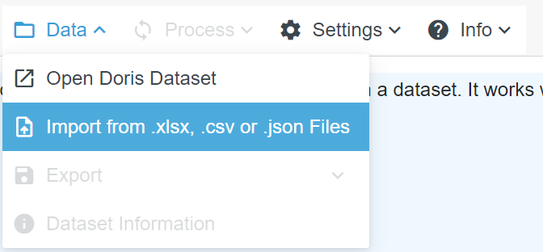
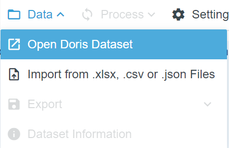
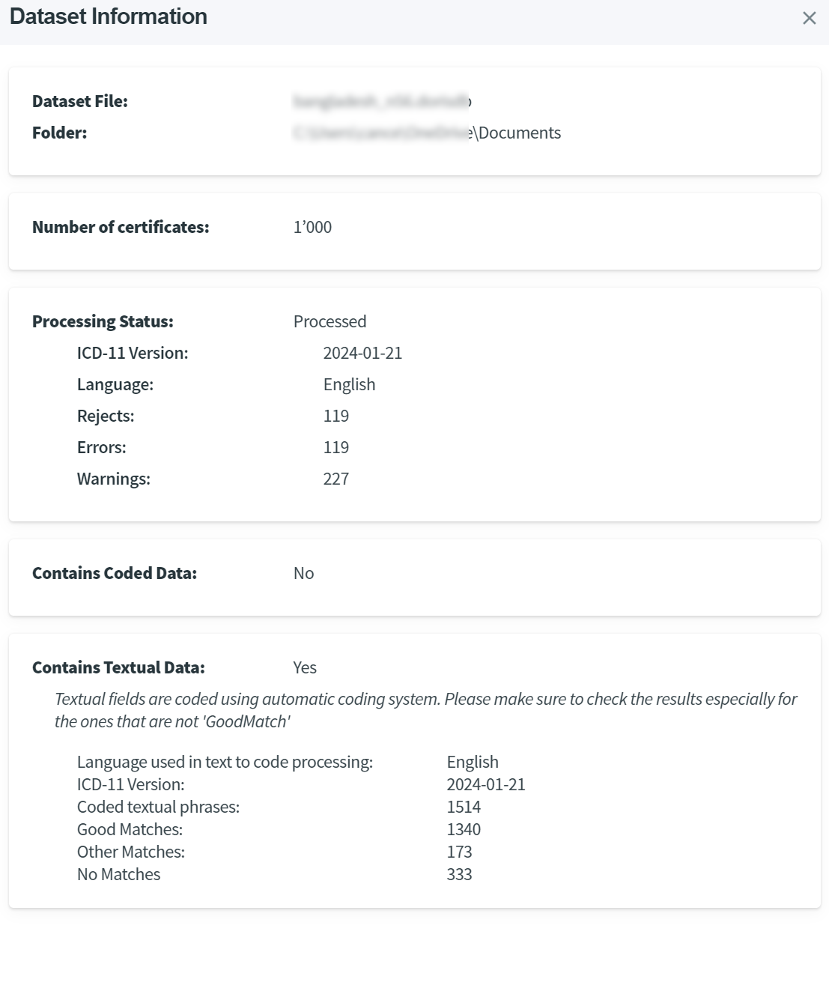
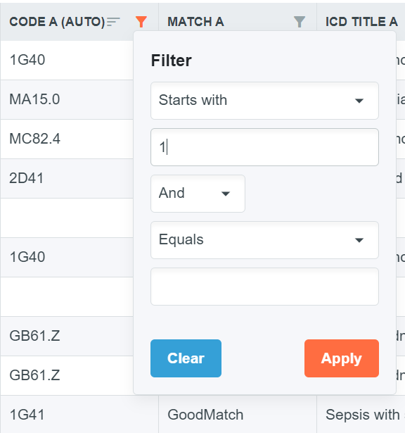
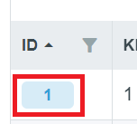
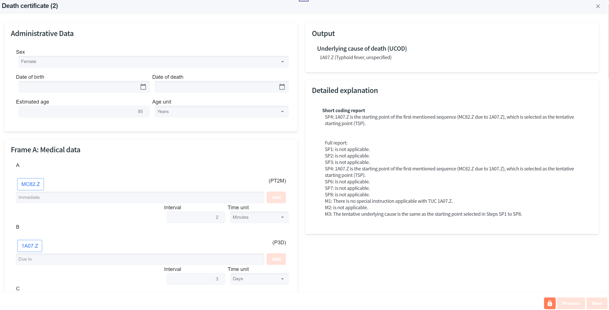
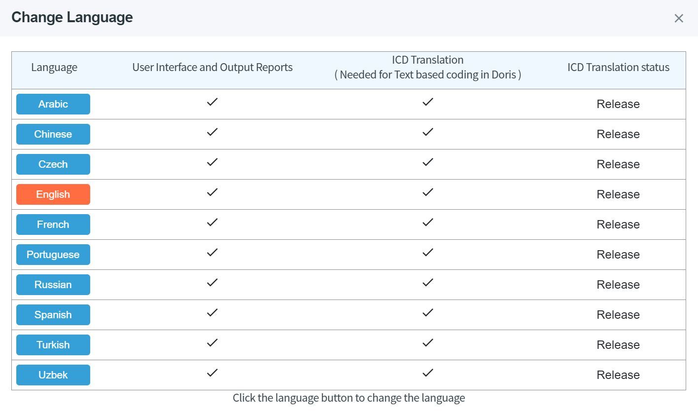

# DORIS Desktop User Guide

DORIS Desktop is a software solution tailored for the efficient batch processing of death certificates. It facilitates the analysis of vast quantities of data, accommodating both coded and textual diagnoses. The software's design emphasizes ease of use, allowing for the importation of certificates in diverse formats such as standard e-MCCD in JSON, Excel and CSV. 

DORIS Desktop requires a `DORIS Dataset` to work with. You may import certificates from a file in one of the supported formats. Once a file is imported, it is saved as a `DORIS Dataset`. After that, everything done in the software uses this `DORIS dataset`. For example, If you use `Process` to compute the underlying cause of death on all certificates, This information is saved into the Doris Dataset and remembered.
You can always open a DORIS Dataset using `Open DORIS Dataset` menu to return to where you left off. 

You can always `Export` the certificates in a `DORIS Dataset` into supported formats.

## Importing Data
You may import certificates using one of the supported file formats. Details of the formats and sample files are available at the links below:

- Detailed description of the [Tabular format for Excel and CSV files](csv-excel-format.md)

- Detailed description of the [Standard JSON format](json-format.md)

{: style="width:40%"}

To import from a file, choose `Import from .xlsx, .csv or .json Files` menu item under the `Data` menu. After that, you need to pick the file that you'd like to import. Then the tool will ask you for a file name for the `DORIS dataset` that will be created. By default, the Doris datasets are created under the Documents folder in Windows. 

{: style="width:50%"}

After giving a file name and clicking `OK`, DORIS will import the file and will show you the contents. The system will show a progress bar at the bottom of the screen if it's a large file that takes time to import.

## Working with DORIS Dataset
DORIS Desktop works with DORIS datasets which are created after you import data using a supported file format. By default, the Doris datasets are created under the Documents folder in Windows. This can be changed from the `Settings`/`Change Default Dataset Folder` menu.

### Opening a Dataset
You could open an existing DORIS dataset using the `Data`/`Open Doris Dataset` menu

{: style="width:30%"}

### Dataset Information
Once a dataset is open, you may use the Dataset Information button or `Data`/`Dataset Information` menu to see information on the dataset.
{: style="width:50%"}

This information contains the number of certificates, whether the data contains coded or textual data, whether the data is processed, and various other information on the dataset. You may see a sample below

{: style="width:60%"}

### Working with certificates that use textual data
If the imported data does not contain codes but textual conditions, then the tool will add codes using text-to-code processing during the importing phase. This process places the auto-assigned codes in the `Code(auto)` column in the tool together with an additional column `Match` that shows the quality of the text-to-code matching process. We suggest all matching levels except for `GoodMatch` need to be manually checked by experts.
{: style="width:60%"}

Text-to-code conversion issues button can be used to easily filter out the cases that contain text-to-code processing with non-GoodMatch results.
{: style="width:20%"}

### Processing the Dataset (Underlying Cause of Death Detection)

Processing the file will compute the underlying cause of death for each certificate. This is done by using the menu `Process`
{: style="width:40%"}

If it's a large dataset, the system will display a progress bar at the bottom of the screen to show the progress.

Once the processing is finished, the results are in the `Underlying Cause of Death (UCOD)` column. If the underlying cause of death is a postcoordination combination it is placed in the `UCOD with postcoordination information` column. Rejected certificates are marked in the `Reject` column and Errors and Warnings are placed in the `Error` and `Warnings` columns.

{: style="width:80%"}

 Certificates that are rejected or have other problems can be easily filtered out by using the Processing Issues button.
{: style="width:20%"}  

### Filtering and Sorting
It is possible to sort the certificates by the values of a selected column by clicking on the column label. 

Similarly, filtering is possible by using the filter icons located near the column labels.
{: style="width:30%"}

### Editing Individual Certificates

Clicking the number in the `Id` column opens the certificate in full-view mode.
{: style="width:80px"}

In full-view mode, all information in the certificate as well as the computed underlying cause of death is shown to the user
{: style="width:80%"}

When opened, the system will not allow editing the certificate. To edit it you need to click the unlock button at the bottom.
{: style="width:30px"}

Once unlocked, you can edit the certificate. Condition lines accept only valid ICD-11 Codes. Editing textual diagnosis is not possible however you could overwrite the textual diagnosis by providing code(s)

Once editing is complete, you may save it by clicking the `Save` button, If not saved, the tool will ignore the changes made after closing the full view.

Closing full-view mode is done by clicking the `X` at the top left corner.

`Process` button in the full-view will reprocess the certificate to find the underlying cause of death. This is saved only after `Save` is pressed. 

It is also possible to process all edited certificates by using the `Process` menu after closing the full view.

## Settings
### Changing Language
Changing the language of the tool is possible by clicking the `Settings`/`Change Language` menu. Once clicked, the system will show the available languages in a new dialog.
{: style="width:50%"} 
The current language is shown in orange color and clicking on another language changes the language.

** IMPORTANT! ** Changing the language requires an Internet connection if the language that is selected has not been used before as the system needs to download the ICD in that language to enable text-to-code processing.

The system uses the language that is selected for 3 separate things:
- The user interface of the tool switches to the selected language.
- During import, if the certificates have textual diagnoses the language selected is used during the text-to-code processing.
- During processing for underlying cause of death detection, the warning messages are provided in the selected language.

### Changing ICD-11 Version
By default, DORIS Desktop uses the latest released version of ICD-11.

It is possible to use another version of ICD-11 during the processing of the certificates. This is done using the `Settings`/`Change ICD Version` menu.

2023 and 2024 versions of ICD-11 are supported by DORIS.

### Changing the default Doris dataset folder
By default, the Doris datasets are created under the Documents folder in Windows. You may change this default folder from the `Settings`/`Change Default Dataset Folder` menu

## Exporting Data
Exporting data in the supported formats is possible using the `Data`/`Export xxxx` menu items
{: style="width:20%"}
